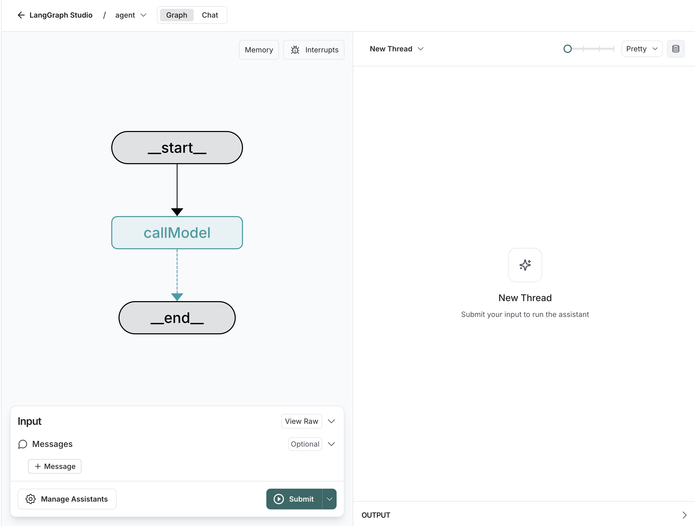

# langgraph-ts-template

[](https://github.com/langchain-ai/new-langgraphjs-project/actions/workflows/unit-tests.yml) [](https://github.com/langchain-ai/new-langgraphjs-project/actions/workflows/integration-tests.yml)

This template now ships the Phase 5 MAW base workflow runtime using [LangGraph.js](https://github.com/langchain-ai/langgraphjs). The runtime is a real `planner` -> `coder` flow built with manual `StateGraph` nodes and one shared package-owned OpenAI `gpt-4.1-mini` model path.

<p align="center">
  
</p>

The core logic, defined in `src/agent/graph.ts`, captures the active Phase 5 contract: planner/coder prompt composition with runtime context injection, explicit planner handoff, and deterministic prompt/handoff inspection fields.

## What it does

The Phase 5 base workflow:

1. Takes a user **message** as input.
2. Renders a planner prompt from embedded defaults plus `.maw/graphs/<workflow>/config.json` and `.maw/templates/*.njk` overrides.
3. Invokes the shared OpenAI model for planner output and derives a non-empty `handoff` string.
4. Renders a coder prompt with shared runtime vars plus the planner `handoff`.
5. Invokes the shared OpenAI model for coder output and returns the final assistant response.
6. Exposes `plannerPrompt`, `coderPrompt`, and `handoff` in graph state for deterministic verification.

Scope note: file/shell/git tool execution is intentionally deferred to Phase 6.

## Getting Started

1. Install the [LangGraph CLI](https://langchain-ai.github.io/langgraph/concepts/langgraph_cli/).

```bash
bunx @langchain/langgraph-cli
```

2. Create a `.env` file if you want live planner/coder model calls during local runtime execution.

```bash
cp .env.example .env
```

3. Add your provider keys in `.env` as needed for live runs.

```
OPENAI_API_KEY=<your-key>
LANGSMITH_API_KEY=lsv2...
```

<!--
Setup instruction auto-generated by `langgraph template lock`. DO NOT EDIT MANUALLY.
-->

<!--
End setup instructions
-->

4. Install dependencies

```bash
bun install
```

5. Customize the code as needed.
6. Start the LangGraph Server.

```bash
bunx @langchain/langgraph-cli dev
```

For more information on getting started with LangGraph Server, [see here](https://langchain-ai.github.io/langgraph/tutorials/langgraph-platform/local-server/).

## How to customize

1. **Tune planner/coder prompts**: Adjust `.maw/graphs/<workflow>/config.json` and `.maw/templates/*.njk` composition inputs.
2. **Extend the graph**: The core flow is defined in [graph.ts](./src/agent/graph.ts). You can add nodes, edges, or adjust planner/coder behavior.

You can also extend this template by:

- Customizing planner/coder prompt snippets for your workflow domain.
- Adding additional graph steps around planner and coder when your workflow needs them.
- Integrating file/shell/git tool execution after the planned Phase 6 runtime integration work lands.

## Development

While iterating on your graph, you can edit past state and rerun your app from previous states to debug specific nodes. Local changes will be automatically applied via hot reload. Try experimenting with:

- Modifying planner and coder prompt composition.
- Verifying handoff behavior between planner and coder.
- Adding targeted conditional graph routing once your workflow needs it.

Follow-up requests will be appended to the same thread. You can create an entirely new thread, clearing previous history, using the `+` button in the top right.

For more advanced features and examples, refer to the [LangGraph.js documentation](https://langchain-ai.github.io/langgraphjs/). These resources can help you adapt this template for your specific workflow.

LangGraph Studio also integrates with [LangSmith](https://smith.langchain.com/) for more in-depth tracing and collaboration with teammates, allowing you to analyze and optimize workflow runtime behavior.

<!--
Configuration auto-generated by `langgraph template lock`. DO NOT EDIT MANUALLY.
{
  "config_schemas": {
    "agent": {
      "type": "object",
      "properties": {}
    }
  }
}
-->
